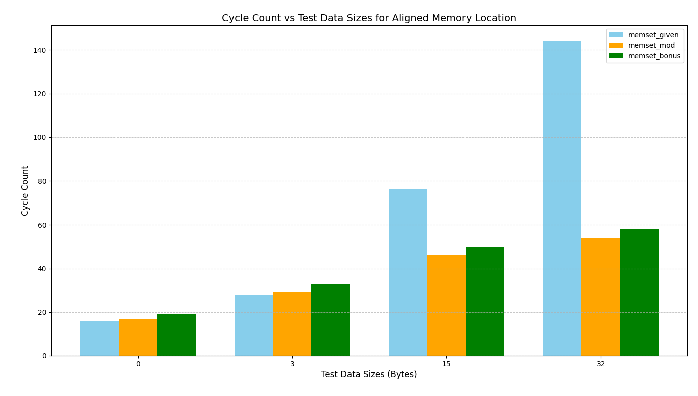
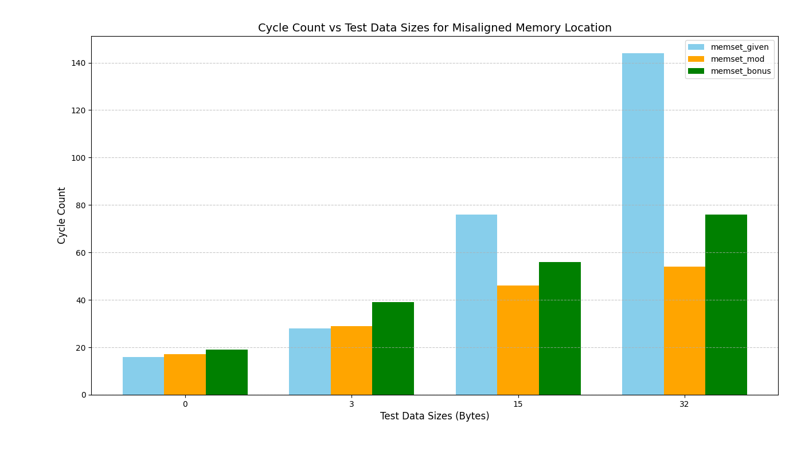

# newlib-coding-challenge

This repo contains my solution to the newlib optimization coding challenge for the 2025 RISC-V mentorship application

The functions are named as:

- `memset_given`: The memset implementation as given in the question.
- `memset_mod`: The modified memset implementation to fit the needs of the challenge.
- `memset_bonus`: memset implementation for the bonus question.

## Challenge - 1

### Approach

The challenge was to optimize the byte-wise store logic of the given memset function to make it more performant for the number of bytes being written into the memory a multiple of 4. The approach taken for the optimization is as follows:

- Check if the input number of bytes is less than 4.
- If no, then prepare the byte-sized write-value to be stored as a word.
- Store the words with `sw` instruction, and the remaining bytes with `sb` instruction.
- If the input number of bytes is less than 4, then directly store the number of bytes.

The test vector used for the number of bytes is `[0, 3, 15, 32]`. The number of cycles taken by each of the functions is attached below.

### Caveats

- Assumed that the implementation is primarily on a 32-bit system, as the question clearly mentions that the memory access times for 32-bits is the same as that of 8-bits, but no details were given regarding the memory access times for 64-bit values.
- Attempted to use an additional loop for storing half-words before reducing the store granularity to bytes, but it would only, at max, save 1 memory access. Since the question clearly mentions that the static code size is critical, I did not implement the half word loop.
- Two approaches were considered for the word store implementation: Calculating the number of words based on the input number of bytes, and then having a fixed number of iterations; and the current implementation of checking if the number of bytes left to be written are still greater than a word at the end of the store word loop. Both the approaches consumed almost the same number of clock cycles, but the latter consumes lesser static code space, hence implemented.

## Challenge - 2 (Bonus)

### Approach

The bonus challenge was to enable the modified function to also be functional in cases where misaligned memory accesses are not allowed (causing the processor to be caught in the state of an exception) (`__riscv_misaligned_avoid == 1`). The approach taken for this is as follows:

- Check if the input address is word-aligned.
- If yes, then call the `memset_mod` function as usual.
- If no, then store the write-value byte-by-byte until the address becomes word-aligned.

The test vector used for the number of bytes is `[0, 3, 15, 32]`. The number of cycles taken by each of the functions is attached below.

### Caveats

- In cases where the input address is word-aligned, `memset_bonus` takes additional 2 clock cycles when the number of bytes to be written is 0, and 4 additional clock cycles when the number of bytes is non-zero.
- In cases where the input address is not word-aligned, and the processor supports misaligned address accesses, of course `memset_bonus` takes significantly more cycles as the number of `sb` stores increases.
- In cases where the input address is not word-aligned, and the processor does not support misaligned address accesses, using the `memset_mod` function traps the processor into an exception:

```
core   0: exception trap_instruction_access_fault, epc 0x0000000000000000
core   0:           tval 0x0000000000000000
```

- For writing bytes into the memory when the address is not word-aligned, I have directly written the logic to store the byte directly rather than calling the `memset_mod` function, to save some static code space.

## Performance Comparisons

A basic functional test has been run on the spike RISC-V instruction set simulator, along with measuring the clock cycles for each version of the memset function. Following are the results:




